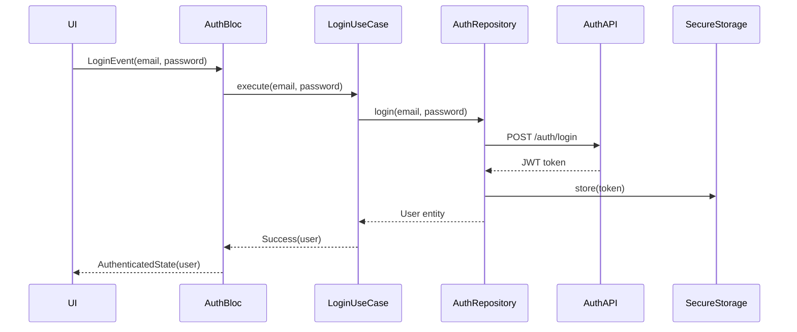

# Design Document: FeloNa Mobile Application

## Overview

FeloNa is a Flutter-based mobile application implementing a circular-economy ecosystem connecting three user roles: Normal Users (sellers/waste generators), Buyers/Recyclers, and Collectors. The application follows Clean Architecture principles with the BLoC (Business Logic Component) pattern for state management, ensuring separation of concerns, testability, and maintainability.

### Architecture Philosophy

The design adopts a layered architecture approach:
- **Presentation Layer**: Flutter widgets and BLoC state management
- **Domain Layer**: Business logic, use cases, and entity models
- **Data Layer**: Repository pattern abstracting API clients and local storage

This separation ensures that business logic remains independent of UI frameworks and data sources, facilitating testing and future modifications.

### Key Design Decisions

1. **BLoC Pattern**: Chosen for its reactive programming model, clear separation between UI and business logic, and excellent testability. BLoC provides predictable state management through streams and events.

2. **Repository Pattern**: Abstracts data sources (REST APIs, local storage) from business logic, allowing easy swapping of implementations and comprehensive unit testing with mocks.

3. **Dio HTTP Client**: Selected over the standard `http` package for its interceptor support (authentication, logging), built-in error handling, and simplified multipart file upload capabilities.

4. **Flutter Secure Storage**: Used for JWT token persistence instead of SharedPreferences, leveraging platform-native secure storage (iOS Keychain, Android Keystore) to protect authentication credentials.

5. **Firebase Cloud Messaging (FCM)**: Industry-standard solution for cross-platform push notifications with reliable delivery and background message handling.

6. **GetIt for Dependency Injection**: Provides service locator pattern for managing dependencies, simplifying testing and reducing coupling between components.

---

## Architecture

### Layer Structure

```
lib/
├── core/
│   ├── constants/
│   ├── errors/
│   ├── network/
│   └── utils/
├── features/
│   ├── auth/
│   │   ├── data/
│   │   │   ├── datasources/
│   │   │   ├── models/
│   │   │   └── repositories/
│   │   ├── domain/
│   │   │   ├── entities/
│   │   │   ├── repositories/
│   │   │   └── usecases/
│   │   └── presentation/
│   │       ├── bloc/
│   │       ├── pages/
│   │       └── widgets/
│   ├── marketplace/
│   ├── pickup/
│   ├── eco_score/
│   └── notifications/
└── main.dart
```

### Clean Architecture Layers

#### Presentation Layer
- **Widgets**: Stateless/Stateful Flutter widgets for UI rendering
- **BLoC**: State management components handling events and emitting states
- **Pages**: Screen-level widgets composing smaller widgets
- Depends on: Domain layer (use cases, entities)

#### Domain Layer
- **Entities**: Pure Dart classes representing business objects
- **Use Cases**: Single-responsibility classes encapsulating business logic
- **Repository Interfaces**: Abstract contracts for data operations
- Depends on: Nothing (pure business logic)

#### Data Layer
- **Models**: Data transfer objects extending entities with JSON serialization
- **Data Sources**: Remote (API) and local (storage) data access
- **Repository Implementations**: Concrete implementations of domain repository interfaces
- Depends on: Domain layer (entities, repository interfaces)

### State Management Flow


### Authentication Flow



---

## Components and Interfaces

### Core Components

#### 1. Network Client (Dio)

**Purpose**: Centralized HTTP client with interceptors for authentication, logging, and error handling.

**Interface**:
```dart
class ApiClient {
  Future<Response> get(String path, {Map<String, dynamic>? queryParameters});
  Future<Response> post(String path, {dynamic data});
  Future<Response> put(String path, {dynamic data});
  Future<Response> delete(String path);
  Future<Response> uploadMultipart(String path, FormData formData);
}
```

**Interceptors**:
- **AuthInterceptor**: Injects JWT token into request headers
- **LoggingInterceptor**: Logs requests/responses for debugging
- **ErrorInterceptor**: Transforms HTTP errors into domain-specific exceptions

#### 2. Secure Storage Service

**Purpose**: Secure persistence of sensitive data (JWT tokens, user credentials).

**Interface**:
```dart
abstract class SecureStorageService {
  Future<void> write(String key, String value);
  Future<String?> read(String key);
  Future<void> delete(String key);
  Future<void> deleteAll();
}
```

**Implementation**: Wraps `flutter_secure_storage` package, using iOS Keychain and Android Keystore.

#### 3. Notification Service

**Purpose**: Handle FCM token registration and message reception.

**Interface**:
```dart
abstract class NotificationService {
  Future<void> initialize();
  Future<String?> getToken();
  Stream<RemoteMessage> get onMessage;
  Stream<RemoteMessage> get onMessageOpenedApp;
  Future<void> requestPermission();
}
```

**Responsibilities**:
- Request notification permissions on app launch
- Register FCM token with backend
- Handle foreground, background, and terminated state messages
- Display local notifications for foreground messages

### Feature Components

#### Authentication Feature

**Entities**:
- `User`: id, email, fullName, role, phoneNumber, profilePictureUrl, ecoPoints

**Use Cases**:
- `RegisterUseCase`: Validates input, calls repository, stores JWT
- `LoginUseCase`: Authenticates user, stores JWT
- `UpdateProfileUseCase`: Updates user profile data
- `UploadProfilePictureUseCase`: Uploads image, updates profile URL
- `LogoutUseCase`: Clears stored JWT and user data

**Repository Interface**:
```dart
abstract class AuthRepository {
  Future<User> register(String email, String password, String fullName, UserRole role);
  Future<User> login(String email, String password);
  Future<User> updateProfile(String userId, {String? fullName, String? phoneNumber});
  Future<String> uploadProfilePicture(String userId, File imageFile);
  Future<void> logout();
  Future<User?> getCurrentUser();
}
```

**BLoC States**:
- `AuthInitial`: Initial state
- `AuthLoading`: Processing authentication
- `Authenticated`: User logged in
- `Unauthenticated`: User logged out
- `AuthError`: Authentication failed

#### Marketplace Feature

**Entities**:
- `Listing`: id, title, description, price, category, images, sellerId, sellerName, status, createdAt
- `Offer`: id, listingId, buyerId, buyerName, proposedPrice, status, createdAt

**Use Cases**:
- `CreateListingUseCase`: Validates listing data, uploads images, creates listing
- `UpdateListingUseCase`: Updates existing listing
- `DeleteListingUseCase`: Soft-deletes listing
- `GetMarketplaceFeedUseCase`: Fetches paginated listings
- `SearchListingsUseCase`: Searches by keyword
- `FilterListingsUseCase`: Filters by category/price
- `SendOfferUseCase`: Creates offer on listing
- `AcceptOfferUseCase`: Accepts offer, marks listing sold
- `RejectOfferUseCase`: Rejects offer

**Repository Interface**:
```dart
abstract class MarketplaceRepository {
  Future<Listing> createListing(CreateListingParams params);
  Future<Listing> updateListing(String listingId, UpdateListingParams params);
  Future<void> deleteListing(String listingId);
  Future<List<Listing>> getMarketplaceFeed(int page, int pageSize);
  Future<List<Listing>> searchListings(String keyword);
  Future<List<Listing>> filterListings({String? category, double? maxPrice});
  Future<Offer> sendOffer(String listingId, double proposedPrice);
  Future<void> acceptOffer(String offerId);
  Future<void> rejectOffer(String offerId);
  Future<List<Offer>> getOffersForListing(String listingId);
}
```

**BLoC States**:
- `MarketplaceLoading`: Fetching data
- `MarketplaceLoaded`: Data available
- `MarketplaceError`: Operation failed
- `ListingCreated`: New listing created successfully
- `OfferSent`: Offer submitted successfully

#### Pickup Feature

**Entities**:
- `PickupRequest`: id, userId, wasteCategory, estimatedWeight, pickupAddress, status, collectorId, collectorName, createdAt, updatedAt

**Use Cases**:
- `CreatePickupRequestUseCase`: Creates new pickup request
- `GetUserPickupRequestsUseCase`: Fetches user's pickup requests
- `GetPendingPickupsUseCase`: Fetches pending pickups for collectors
- `AcceptPickupUseCase`: Collector accepts pickup
- `UpdatePickupStatusUseCase`: Updates pickup status with validation

**Repository Interface**:
```dart
abstract class PickupRepository {
  Future<PickupRequest> createPickupRequest(CreatePickupParams params);
  Future<List<PickupRequest>> getUserPickupRequests(String userId);
  Future<List<PickupRequest>> getPendingPickups();
  Future<PickupRequest> acceptPickup(String pickupId);
  Future<PickupRequest> updatePickupStatus(String pickupId, PickupStatus newStatus);
}
```

**BLoC States**:
- `PickupLoading`: Processing request
- `PickupLoaded`: Data available
- `PickupCreated`: New request created
- `PickupAccepted`: Collector assigned
- `PickupStatusUpdated`: Status changed
- `PickupError`: Operation failed

#### Eco Score Feature

**Entities**:
- `EcoScore`: userId, totalPoints, totalWeightRecycled, pointHistory
- `PointEvent`: id, userId, points, reason, timestamp

**Use Cases**:
- `GetEcoScoreUseCase`: Fetches user's eco score data
- `GetPointHistoryUseCase`: Fetches point-earning history

**Repository Interface**:
```dart
abstract class EcoScoreRepository {
  Future<EcoScore> getEcoScore(String userId);
  Future<List<PointEvent>> getPointHistory(String userId);
}
```

**Note**: Point calculation is handled server-side when pickup completes or offer is accepted.

---

## Data Models

### User Model

```dart
class UserModel extends User {
  const UserModel({
    required String id,
    required String email,
    required String fullName,
    required UserRole role,
    String? phoneNumber,
    String? profilePictureUrl,
    int ecoPoints = 0,
  }) : super(
    id: id,
    email: email,
    fullName: fullName,
    role: role,
    phoneNumber: phoneNumber,
    profilePictureUrl: profilePictureUrl,
    ecoPoints: ecoPoints,
  );

  factory UserModel.fromJson(Map<String, dynamic> json) {
    return UserModel(
      id: json['id'],
      email: json['email'],
      fullName: json['full_name'],
      role: UserRole.fromString(json['role']),
      phoneNumber: json['phone_number'],
      profilePictureUrl: json['profile_picture_url'],
      ecoPoints: json['eco_points'] ?? 0,
    );
  }

  Map<String, dynamic> toJson() {
    return {
      'id': id,
      'email': email,
      'full_name': fullName,
      'role': role.toString(),
      'phone_number': phoneNumber,
      'profile_picture_url': profilePictureUrl,
      'eco_points': ecoPoints,
    };
  }
}
```

### Listing Model

```dart
class ListingModel extends Listing {
  const ListingModel({
    required String id,
    required String title,
    required String description,
    required double price,
    required String category,
    required List<String> images,
    required String sellerId,
    required String sellerName,
    required ListingStatus status,
    required DateTime createdAt,
  }) : super(
    id: id,
    title: title,
    description: description,
    price: price,
    category: category,
    images: images,
    sellerId: sellerId,
    sellerName: sellerName,
    status: status,
    createdAt: createdAt,
  );

  factory ListingModel.fromJson(Map<String, dynamic> json) {
    return ListingModel(
      id: json['id'],
      title: json['title'],
      description: json['description'],
      price: json['price'].toDouble(),
      category: json['category'],
      images: List<String>.from(json['images']),
      sellerId: json['seller_id'],
      sellerName: json['seller_name'],
      status: ListingStatus.fromString(json['status']),
      createdAt: DateTime.parse(json['created_at']),
    );
  }

  Map<String, dynamic> toJson() {
    return {
      'id': id,
      'title': title,
      'description': description,
      'price': price,
      'category': category,
      'images': images,
      'seller_id': sellerId,
      'seller_name': sellerName,
      'status': status.toString(),
      'created_at': createdAt.toIso8601String(),
    };
  }
}
```

### PickupRequest Model

```dart
class PickupRequestModel extends PickupRequest {
  const PickupRequestModel({
    required String id,
    required String userId,
    required WasteCategory wasteCategory,
    required double estimatedWeight,
    required String pickupAddress,
    required PickupStatus status,
    String? collectorId,
    String? collectorName,
    required DateTime createdAt,
    DateTime? updatedAt,
  }) : super(
    id: id,
    userId: userId,
    wasteCategory: wasteCategory,
    estimatedWeight: estimatedWeight,
    pickupAddress: pickupAddress,
    status: status,
    collectorId: collectorId,
    collectorName: collectorName,
    createdAt: createdAt,
    updatedAt: updatedAt,
  );

  factory PickupRequestModel.fromJson(Map<String, dynamic> json) {
    return PickupRequestModel(
      id: json['id'],
      userId: json['user_id'],
      wasteCategory: WasteCategory.fromString(json['waste_category']),
      estimatedWeight: json['estimated_weight'].toDouble(),
      pickupAddress: json['pickup_address'],
      status: PickupStatus.fromString(json['status']),
      collectorId: json['collector_id'],
      collectorName: json['collector_name'],
      createdAt: DateTime.parse(json['created_at']),
      updatedAt: json['updated_at'] != null ? DateTime.parse(json['updated_at']) : null,
    );
  }

  Map<String, dynamic> toJson() {
    return {
      'id': id,
      'user_id': userId,
      'waste_category': wasteCategory.toString(),
      'estimated_weight': estimatedWeight,
      'pickup_address': pickupAddress,
      'status': status.toString(),
      'collector_id': collectorId,
      'collector_name': collectorName,
      'created_at': createdAt.toIso8601String(),
      'updated_at': updatedAt?.toIso8601String(),
    };
  }
}
```

### Enumerations

```dart
enum UserRole {
  normalUser,
  buyer,
  collector;

  static UserRole fromString(String value) {
    switch (value.toLowerCase()) {
      case 'normal_user':
        return UserRole.normalUser;
      case 'buyer':
        return UserRole.buyer;
      case 'collector':
        return UserRole.collector;
      default:
        throw ArgumentError('Invalid user role: $value');
    }
  }
}

enum ListingStatus {
  active,
  sold,
  deleted;

  static ListingStatus fromString(String value) {
    return ListingStatus.values.firstWhere(
      (e) => e.name == value.toLowerCase(),
      orElse: () => throw ArgumentError('Invalid listing status: $value'),
    );
  }
}

enum PickupStatus {
  pending,
  accepted,
  onTheWay,
  completed;

  static PickupStatus fromString(String value) {
    switch (value.toLowerCase()) {
      case 'pending':
        return PickupStatus.pending;
      case 'accepted':
        return PickupStatus.accepted;
      case 'on_the_way':
        return PickupStatus.onTheWay;
      case 'completed':
        return PickupStatus.completed;
      default:
        throw ArgumentError('Invalid pickup status: $value');
    }
  }
}

enum WasteCategory {
  plastic,
  metal,
  paper,
  glass,
  electronics,
  other;

  static WasteCategory fromString(String value) {
    return WasteCategory.values.firstWhere(
      (e) => e.name == value.toLowerCase(),
      orElse: () => throw ArgumentError('Invalid waste category: $value'),
    );
  }
}

enum OfferStatus {
  pending,
  accepted,
  rejected;

  static OfferStatus fromString(String value) {
    return OfferStatus.values.firstWhere(
      (e) => e.name == value.toLowerCase(),
      orElse: () => throw ArgumentError('Invalid offer status: $value'),
    );
  }
}
```

---

## Correctness Properties

**Property-based testing is NOT applicable to this feature.**

This Flutter mobile application is primarily a UI layer that orchestrates backend services through REST API calls. The core business logic (validation, state transitions, calculations) resides in backend services (Auth_Service, Marketplace_Service, Pickup_Service, Eco_Score_Service, Notification_Service), not in the Flutter app.

After analyzing all 48 acceptance criteria across 12 requirements, none are suitable for property-based testing because:

1. **Backend Logic**: Business rules are implemented in backend services, not the Flutter app
2. **UI Rendering**: Most criteria specify UI behavior best tested with widget tests
3. **API Integration**: Testing external service contracts, not pure functions
4. **No Universal Properties**: Criteria specify concrete thresholds and specific behaviors, not properties that hold "for all inputs"

The only client-side logic (input validation, JSON serialization, status transitions) is better tested with example-based unit tests covering specific edge cases rather than property-based tests with randomized inputs.

**Testing Strategy**: The application uses example-based unit tests (60%), widget tests (30%), and integration tests (10%) as detailed in the Testing Strategy section below.

---

## Error Handling

### Error Architecture

The application implements a layered error handling strategy that transforms low-level exceptions into domain-specific failures, providing meaningful feedback to users while maintaining system stability.

#### Exception Hierarchy

```dart
abstract class AppException implements Exception {
  final String message;
  final String? code;
  
  const AppException(this.message, [this.code]);
}

class NetworkException extends AppException {
  const NetworkException(String message, [String? code]) : super(message, code);
}

class AuthenticationException extends AppException {
  const AuthenticationException(String message, [String? code]) : super(message, code);
}

class ValidationException extends AppException {
  final Map<String, String> fieldErrors;
  
  const ValidationException(String message, this.fieldErrors, [String? code]) 
      : super(message, code);
}

class AuthorizationException extends AppException {
  const AuthorizationException(String message, [String? code]) : super(message, code);
}

class ServerException extends AppException {
  final int? statusCode;
  
  const ServerException(String message, [this.statusCode, String? code]) 
      : super(message, code);
}

class StorageException extends AppException {
  const StorageException(String message, [String? code]) : super(message, code);
}
```

### Error Transformation Strategy

#### Network Layer (Dio Interceptor)

The `ErrorInterceptor` transforms HTTP errors into domain exceptions:

```dart
class ErrorInterceptor extends Interceptor {
  @override
  void onError(DioException err, ErrorInterceptorHandler handler) {
    AppException exception;
    
    switch (err.type) {
      case DioExceptionType.connectionTimeout:
      case DioExceptionType.sendTimeout:
      case DioExceptionType.receiveTimeout:
        exception = NetworkException('Connection timeout. Please check your internet connection.');
        break;
        
      case DioExceptionType.badResponse:
        exception = _handleResponseError(err.response);
        break;
        
      case DioExceptionType.cancel:
        exception = NetworkException('Request cancelled.');
        break;
        
      default:
        exception = NetworkException('Network error occurred. Please try again.');
    }
    
    handler.reject(DioException(
      requestOptions: err.requestOptions,
      error: exception,
    ));
  }
  
  AppException _handleResponseError(Response? response) {
    if (response == null) {
      return ServerException('No response from server.');
    }
    
    final statusCode = response.statusCode ?? 0;
    final data = response.data;
    
    switch (statusCode) {
      case 400:
        return ValidationException(
          data['message'] ?? 'Invalid request.',
          _parseFieldErrors(data),
        );
      case 401:
        return AuthenticationException(data['message'] ?? 'Authentication failed.');
      case 403:
        return AuthorizationException(data['message'] ?? 'Access denied.');
      case 404:
        return ServerException('Resource not found.', statusCode);
      case 409:
        return ValidationException(
          data['message'] ?? 'Conflict occurred.',
          _parseFieldErrors(data),
        );
      case 500:
      case 502:
      case 503:
        return ServerException('Server error. Please try again later.', statusCode);
      default:
        return ServerException('Unexpected error occurred.', statusCode);
    }
  }
  
  Map<String, String> _parseFieldErrors(dynamic data) {
    if (data is Map && data.containsKey('errors')) {
      return Map<String, String>.from(data['errors']);
    }
    return {};
  }
}
```

#### Repository Layer

Repositories catch exceptions from data sources and wrap them in `Either<Failure, Success>` results:

```dart
abstract class Failure {
  final String message;
  final String? code;
  
  const Failure(this.message, [this.code]);
}

class NetworkFailure extends Failure {
  const NetworkFailure(String message, [String? code]) : super(message, code);
}

class AuthFailure extends Failure {
  const AuthFailure(String message, [String? code]) : super(message, code);
}

class ValidationFailure extends Failure {
  final Map<String, String> fieldErrors;
  
  const ValidationFailure(String message, this.fieldErrors, [String? code]) 
      : super(message, code);
}

class ServerFailure extends Failure {
  const ServerFailure(String message, [String? code]) : super(message, code);
}

// Repository implementation example
@override
Future<Either<Failure, User>> login(String email, String password) async {
  try {
    final response = await _apiClient.post('/auth/login', data: {
      'email': email,
      'password': password,
    });
    
    final user = UserModel.fromJson(response.data['user']);
    final token = response.data['token'];
    
    await _secureStorage.write('auth_token', token);
    
    return Right(user);
  } on AuthenticationException catch (e) {
    return Left(AuthFailure(e.message, e.code));
  } on NetworkException catch (e) {
    return Left(NetworkFailure(e.message, e.code));
  } on ValidationException catch (e) {
    return Left(ValidationFailure(e.message, e.fieldErrors, e.code));
  } on ServerException catch (e) {
    return Left(ServerFailure(e.message, e.code));
  } catch (e) {
    return Left(ServerFailure('Unexpected error: ${e.toString()}'));
  }
}
```

#### BLoC Layer

BLoCs handle failures and emit appropriate error states:

```dart
class AuthBloc extends Bloc<AuthEvent, AuthState> {
  final LoginUseCase _loginUseCase;
  
  AuthBloc(this._loginUseCase) : super(AuthInitial()) {
    on<LoginRequested>(_onLoginRequested);
  }
  
  Future<void> _onLoginRequested(
    LoginRequested event,
    Emitter<AuthState> emit,
  ) async {
    emit(AuthLoading());
    
    final result = await _loginUseCase(
      email: event.email,
      password: event.password,
    );
    
    result.fold(
      (failure) => emit(AuthError(_mapFailureToMessage(failure))),
      (user) => emit(Authenticated(user)),
    );
  }
  
  String _mapFailureToMessage(Failure failure) {
    if (failure is NetworkFailure) {
      return 'No internet connection. Please check your network.';
    } else if (failure is AuthFailure) {
      return 'Invalid email or password.';
    } else if (failure is ValidationFailure) {
      return failure.message;
    } else {
      return 'An unexpected error occurred. Please try again.';
    }
  }
}
```

#### Presentation Layer

UI widgets display errors to users through snackbars, dialogs, or inline messages:

```dart
BlocListener<AuthBloc, AuthState>(
  listener: (context, state) {
    if (state is AuthError) {
      ScaffoldMessenger.of(context).showSnackBar(
        SnackBar(
          content: Text(state.message),
          backgroundColor: Colors.red,
          action: SnackBarAction(
            label: 'Dismiss',
            textColor: Colors.white,
            onPressed: () {},
          ),
        ),
      );
    }
  },
  child: // ... widget tree
)
```

### Specific Error Scenarios

#### JWT Expiration

When a JWT expires (detected via 401 response with specific error code):

1. `AuthInterceptor` detects expired token
2. Clears stored JWT from secure storage
3. Emits `TokenExpired` event to `AuthBloc`
4. `AuthBloc` transitions to `Unauthenticated` state
5. App navigates to login screen
6. User sees message: "Your session has expired. Please log in again."

#### Network Connectivity Loss

When network connection is lost:

1. Dio throws `DioExceptionType.connectionTimeout` or similar
2. `ErrorInterceptor` transforms to `NetworkException`
3. Repository returns `NetworkFailure`
4. BLoC emits error state with user-friendly message
5. UI displays retry button and offline indicator

#### File Upload Failures

When image upload fails (size, format, network):

1. Client-side validation checks file size and format before upload
2. If validation fails, display inline error without API call
3. If upload fails mid-transfer, catch `NetworkException`
4. Display error with retry option
5. Preserve user's form data for retry

#### Validation Errors

When backend returns validation errors (400 with field errors):

1. `ErrorInterceptor` parses field-level errors from response
2. Repository returns `ValidationFailure` with `fieldErrors` map
3. BLoC emits state containing field errors
4. UI displays inline error messages below respective form fields

---

## Testing Strategy

### Overview

The FeloNa application testing strategy focuses on three complementary testing approaches:

1. **Unit Tests**: Test individual components in isolation (use cases, repositories, BLoCs, utilities)
2. **Widget Tests**: Test UI components and user interactions
3. **Integration Tests**: Test end-to-end flows with real backend APIs

**Property-based testing is NOT applicable** to this feature because:
- The application is primarily UI rendering and REST API integration
- Most business logic resides in the backend services, not the Flutter app
- The Flutter app's role is orchestration, state management, and presentation
- Acceptance criteria test backend behavior (external services) or UI rendering
- Only 2 out of 48 acceptance criteria involve client-side logic suitable for PBT

Instead, we use **example-based unit tests** for client-side validation logic, **widget tests** for UI behavior, and **integration tests** for API contracts.

### Testing Pyramid

```
        /\
       /  \
      / IT \      Integration Tests (10%)
     /______\     - End-to-end user flows
    /        \    - API contract validation
   /  Widget  \   Widget Tests (30%)
  /   Tests    \  - UI component behavior
 /______________\ - User interactions
/                \
/   Unit Tests    \ Unit Tests (60%)
/__________________\ - Business logic
                     - State management
                     - Data transformations
```

### Unit Testing

#### Scope

- **Use Cases**: Business logic validation
- **Repositories**: Data transformation and error handling
- **BLoCs**: State transitions and event handling
- **Models**: JSON serialization/deserialization
- **Validators**: Input validation logic
- **Utilities**: Helper functions

#### Testing Framework

- **Package**: `flutter_test` (built-in)
- **Mocking**: `mockito` with code generation
- **BLoC Testing**: `bloc_test` package

#### Example: Use Case Test

```dart
void main() {
  late LoginUseCase loginUseCase;
  late MockAuthRepository mockAuthRepository;
  
  setUp(() {
    mockAuthRepository = MockAuthRepository();
    loginUseCase = LoginUseCase(mockAuthRepository);
  });
  
  group('LoginUseCase', () {
    const tEmail = 'test@example.com';
    const tPassword = 'password123';
    const tUser = User(
      id: '1',
      email: tEmail,
      fullName: 'Test User',
      role: UserRole.normalUser,
    );
    
    test('should return User when login is successful', () async {
      // arrange
      when(mockAuthRepository.login(tEmail, tPassword))
          .thenAnswer((_) async => Right(tUser));
      
      // act
      final result = await loginUseCase(email: tEmail, password: tPassword);
      
      // assert
      expect(result, Right(tUser));
      verify(mockAuthRepository.login(tEmail, tPassword));
      verifyNoMoreInteractions(mockAuthRepository);
    });
    
    test('should return AuthFailure when credentials are invalid', () async {
      // arrange
      when(mockAuthRepository.login(tEmail, tPassword))
          .thenAnswer((_) async => Left(AuthFailure('Invalid credentials')));
      
      // act
      final result = await loginUseCase(email: tEmail, password: tPassword);
      
      // assert
      expect(result, Left(AuthFailure('Invalid credentials')));
      verify(mockAuthRepository.login(tEmail, tPassword));
    });
  });
}
```

#### Example: BLoC Test

```dart
void main() {
  late AuthBloc authBloc;
  late MockLoginUseCase mockLoginUseCase;
  
  setUp(() {
    mockLoginUseCase = MockLoginUseCase();
    authBloc = AuthBloc(mockLoginUseCase);
  });
  
  tearDown(() {
    authBloc.close();
  });
  
  group('AuthBloc', () {
    const tEmail = 'test@example.com';
    const tPassword = 'password123';
    const tUser = User(
      id: '1',
      email: tEmail,
      fullName: 'Test User',
      role: UserRole.normalUser,
    );
    
    blocTest<AuthBloc, AuthState>(
      'emits [AuthLoading, Authenticated] when login succeeds',
      build: () {
        when(mockLoginUseCase(email: tEmail, password: tPassword))
            .thenAnswer((_) async => Right(tUser));
        return authBloc;
      },
      act: (bloc) => bloc.add(LoginRequested(tEmail, tPassword)),
      expect: () => [
        AuthLoading(),
        Authenticated(tUser),
      ],
      verify: (_) {
        verify(mockLoginUseCase(email: tEmail, password: tPassword));
      },
    );
    
    blocTest<AuthBloc, AuthState>(
      'emits [AuthLoading, AuthError] when login fails',
      build: () {
        when(mockLoginUseCase(email: tEmail, password: tPassword))
            .thenAnswer((_) async => Left(AuthFailure('Invalid credentials')));
        return authBloc;
      },
      act: (bloc) => bloc.add(LoginRequested(tEmail, tPassword)),
      expect: () => [
        AuthLoading(),
        AuthError('Invalid email or password.'),
      ],
    );
  });
}
```

#### Example: Model Serialization Test

```dart
void main() {
  group('UserModel', () {
    const tUserModel = UserModel(
      id: '1',
      email: 'test@example.com',
      fullName: 'Test User',
      role: UserRole.normalUser,
      phoneNumber: '+1234567890',
      profilePictureUrl: 'https://example.com/pic.jpg',
      ecoPoints: 100,
    );
    
    test('should serialize to JSON correctly', () {
      // act
      final json = tUserModel.toJson();
      
      // assert
      expect(json, {
        'id': '1',
        'email': 'test@example.com',
        'full_name': 'Test User',
        'role': 'normalUser',
        'phone_number': '+1234567890',
        'profile_picture_url': 'https://example.com/pic.jpg',
        'eco_points': 100,
      });
    });
    
    test('should deserialize from JSON correctly', () {
      // arrange
      final json = {
        'id': '1',
        'email': 'test@example.com',
        'full_name': 'Test User',
        'role': 'normal_user',
        'phone_number': '+1234567890',
        'profile_picture_url': 'https://example.com/pic.jpg',
        'eco_points': 100,
      };
      
      // act
      final result = UserModel.fromJson(json);
      
      // assert
      expect(result, tUserModel);
    });
  });
}
```

#### Example: Validation Test

```dart
void main() {
  group('PickupStatusValidator', () {
    test('should allow transition from Pending to Accepted', () {
      // act
      final result = PickupStatusValidator.canTransition(
        from: PickupStatus.pending,
        to: PickupStatus.accepted,
      );
      
      // assert
      expect(result, true);
    });
    
    test('should allow transition from Accepted to OnTheWay', () {
      // act
      final result = PickupStatusValidator.canTransition(
        from: PickupStatus.accepted,
        to: PickupStatus.onTheWay,
      );
      
      // assert
      expect(result, true);
    });
    
    test('should reject transition from Pending to Completed', () {
      // act
      final result = PickupStatusValidator.canTransition(
        from: PickupStatus.pending,
        to: PickupStatus.completed,
      );
      
      // assert
      expect(result, false);
    });
    
    test('should reject backward transition from Completed to Accepted', () {
      // act
      final result = PickupStatusValidator.canTransition(
        from: PickupStatus.completed,
        to: PickupStatus.accepted,
      );
      
      // assert
      expect(result, false);
    });
  });
}
```

### Widget Testing

#### Scope

- **UI Components**: Individual widgets and widget compositions
- **User Interactions**: Tap, scroll, text input
- **State Rendering**: Conditional UI based on state
- **Navigation**: Route transitions
- **Form Validation**: Client-side validation feedback

#### Testing Framework

- **Package**: `flutter_test` (built-in)
- **Mocking**: `mocktail` for BLoC mocking

#### Example: Login Screen Widget Test

```dart
void main() {
  late MockAuthBloc mockAuthBloc;
  
  setUp(() {
    mockAuthBloc = MockAuthBloc();
  });
  
  Widget createWidgetUnderTest() {
    return MaterialApp(
      home: BlocProvider<AuthBloc>.value(
        value: mockAuthBloc,
        child: LoginScreen(),
      ),
    );
  }
  
  group('LoginScreen', () {
    testWidgets('should display email and password fields', (tester) async {
      // arrange
      when(() => mockAuthBloc.state).thenReturn(AuthInitial());
      
      // act
      await tester.pumpWidget(createWidgetUnderTest());
      
      // assert
      expect(find.byType(TextField), findsNWidgets(2));
      expect(find.text('Email'), findsOneWidget);
      expect(find.text('Password'), findsOneWidget);
    });
    
    testWidgets('should dispatch LoginRequested when login button is tapped', 
        (tester) async {
      // arrange
      when(() => mockAuthBloc.state).thenReturn(AuthInitial());
      when(() => mockAuthBloc.add(any())).thenReturn(null);
      
      // act
      await tester.pumpWidget(createWidgetUnderTest());
      await tester.enterText(find.byType(TextField).first, 'test@example.com');
      await tester.enterText(find.byType(TextField).last, 'password123');
      await tester.tap(find.text('Login'));
      await tester.pump();
      
      // assert
      verify(() => mockAuthBloc.add(
        LoginRequested('test@example.com', 'password123')
      )).called(1);
    });
    
    testWidgets('should show loading indicator when state is AuthLoading', 
        (tester) async {
      // arrange
      when(() => mockAuthBloc.state).thenReturn(AuthLoading());
      
      // act
      await tester.pumpWidget(createWidgetUnderTest());
      
      // assert
      expect(find.byType(CircularProgressIndicator), findsOneWidget);
    });
    
    testWidgets('should show error snackbar when state is AuthError', 
        (tester) async {
      // arrange
      whenListen(
        mockAuthBloc,
        Stream.fromIterable([AuthInitial(), AuthError('Invalid credentials')]),
        initialState: AuthInitial(),
      );
      
      // act
      await tester.pumpWidget(createWidgetUnderTest());
      await tester.pump();
      
      // assert
      expect(find.byType(SnackBar), findsOneWidget);
      expect(find.text('Invalid credentials'), findsOneWidget);
    });
  });
}
```

#### Example: Listing Card Widget Test

```dart
void main() {
  group('ListingCard', () {
    const tListing = Listing(
      id: '1',
      title: 'Used Laptop',
      description: 'Dell laptop in good condition',
      price: 250.0,
      category: 'Electronics',
      images: ['https://example.com/laptop.jpg'],
      sellerId: 'seller1',
      sellerName: 'John Doe',
      status: ListingStatus.active,
      createdAt: '2024-01-15T10:00:00Z',
    );
    
    testWidgets('should display listing title, price, and seller name', 
        (tester) async {
      // act
      await tester.pumpWidget(MaterialApp(
        home: Scaffold(body: ListingCard(listing: tListing)),
      ));
      
      // assert
      expect(find.text('Used Laptop'), findsOneWidget);
      expect(find.text('\$250.00'), findsOneWidget);
      expect(find.text('John Doe'), findsOneWidget);
    });
    
    testWidgets('should display primary image', (tester) async {
      // act
      await tester.pumpWidget(MaterialApp(
        home: Scaffold(body: ListingCard(listing: tListing)),
      ));
      
      // assert
      final imageFinder = find.byType(Image);
      expect(imageFinder, findsOneWidget);
      
      final image = tester.widget<Image>(imageFinder);
      final networkImage = image.image as NetworkImage;
      expect(networkImage.url, 'https://example.com/laptop.jpg');
    });
    
    testWidgets('should call onTap callback when tapped', (tester) async {
      // arrange
      bool tapped = false;
      
      // act
      await tester.pumpWidget(MaterialApp(
        home: Scaffold(
          body: ListingCard(
            listing: tListing,
            onTap: () => tapped = true,
          ),
        ),
      ));
      await tester.tap(find.byType(ListingCard));
      
      // assert
      expect(tapped, true);
    });
  });
}
```

### Integration Testing

#### Scope

- **End-to-End Flows**: Complete user journeys (registration → login → create listing)
- **API Contract Validation**: Verify backend API responses match expected format
- **Authentication Flow**: JWT token handling and expiration
- **Push Notifications**: FCM message reception and handling
- **Image Upload**: Multipart form data submission

#### Testing Framework

- **Package**: `integration_test` (Flutter official)
- **Environment**: Test backend or staging environment

#### Example: Registration and Login Flow

```dart
void main() {
  IntegrationTestWidgetsFlutterBinding.ensureInitialized();
  
  group('Authentication Flow', () {
    testWidgets('should register new user and login successfully', 
        (tester) async {
      // Start app
      await tester.pumpWidget(MyApp());
      await tester.pumpAndSettle();
      
      // Navigate to registration
      await tester.tap(find.text('Register'));
      await tester.pumpAndSettle();
      
      // Fill registration form
      await tester.enterText(
        find.byKey(Key('fullNameField')),
        'Test User',
      );
      await tester.enterText(
        find.byKey(Key('emailField')),
        'test${DateTime.now().millisecondsSinceEpoch}@example.com',
      );
      await tester.enterText(
        find.byKey(Key('passwordField')),
        'password123',
      );
      
      // Select role
      await tester.tap(find.text('Normal User'));
      await tester.pumpAndSettle();
      
      // Submit registration
      await tester.tap(find.text('Register'));
      await tester.pumpAndSettle(Duration(seconds: 3));
      
      // Verify navigation to dashboard
      expect(find.text('Dashboard'), findsOneWidget);
      
      // Logout
      await tester.tap(find.byIcon(Icons.logout));
      await tester.pumpAndSettle();
      
      // Login with same credentials
      await tester.enterText(
        find.byKey(Key('emailField')),
        'test${DateTime.now().millisecondsSinceEpoch}@example.com',
      );
      await tester.enterText(
        find.byKey(Key('passwordField')),
        'password123',
      );
      await tester.tap(find.text('Login'));
      await tester.pumpAndSettle(Duration(seconds: 3));
      
      // Verify successful login
      expect(find.text('Dashboard'), findsOneWidget);
    });
  });
}
```

#### Example: Create Listing Flow

```dart
void main() {
  IntegrationTestWidgetsFlutterBinding.ensureInitialized();
  
  group('Marketplace Flow', () {
    testWidgets('should create new listing with images', (tester) async {
      // Login first
      await loginAsNormalUser(tester);
      
      // Navigate to create listing
      await tester.tap(find.byIcon(Icons.add));
      await tester.pumpAndSettle();
      
      // Fill listing form
      await tester.enterText(
        find.byKey(Key('titleField')),
        'Test Laptop',
      );
      await tester.enterText(
        find.byKey(Key('descriptionField')),
        'Used laptop in excellent condition',
      );
      await tester.enterText(
        find.byKey(Key('priceField')),
        '250',
      );
      
      // Select category
      await tester.tap(find.text('Category'));
      await tester.pumpAndSettle();
      await tester.tap(find.text('Electronics'));
      await tester.pumpAndSettle();
      
      // Add image (mock image picker)
      await tester.tap(find.byIcon(Icons.add_photo_alternate));
      await tester.pumpAndSettle();
      
      // Submit listing
      await tester.tap(find.text('Create Listing'));
      await tester.pumpAndSettle(Duration(seconds: 3));
      
      // Verify listing appears in feed
      expect(find.text('Test Laptop'), findsOneWidget);
      expect(find.text('\$250.00'), findsOneWidget);
    });
  });
}
```

### Test Coverage Goals

- **Unit Tests**: 80% code coverage minimum
- **Widget Tests**: All user-facing screens and reusable widgets
- **Integration Tests**: Critical user flows (authentication, listing creation, pickup request, offer flow)

### Continuous Integration

Tests run automatically on:
- Every pull request
- Every commit to main branch
- Nightly builds for integration tests

### Test Data Management

- **Unit/Widget Tests**: Use mock data and fixtures
- **Integration Tests**: Use test backend with isolated test database
- **Cleanup**: Integration tests clean up created data after execution

---

