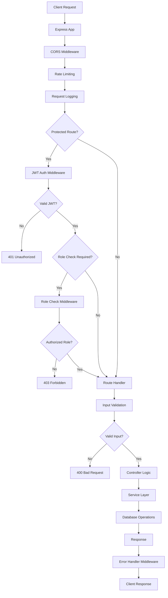
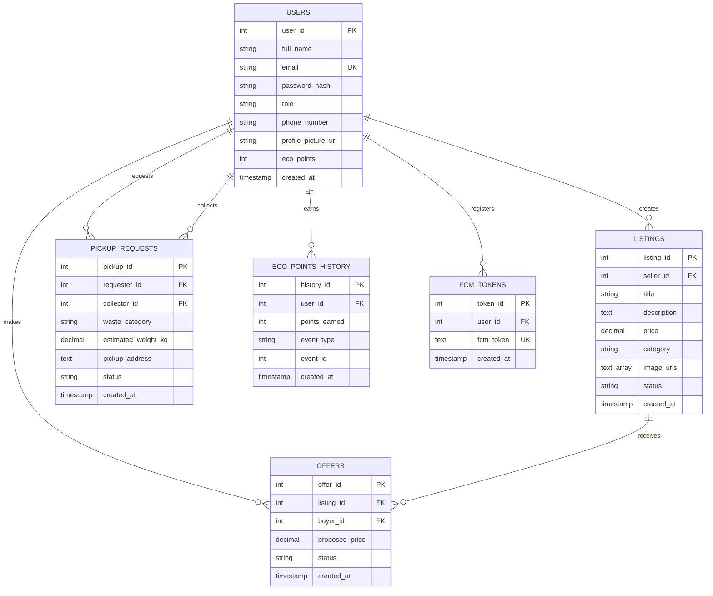

# Design Document: FeloNa Backend API

## Overview

The FeloNa Backend API is a RESTful API system built with Node.js and Express.js that provides comprehensive backend services for the FeloNa mobile application. The system manages three distinct user roles (Normal Users, Buyers, and Collectors) and provides five core functional modules: authentication, marketplace management, pickup coordination, eco-score tracking, and push notifications.

### Technology Stack

- **Runtime**: Node.js (v18+ recommended)
- **Web Framework**: Express.js v4.x
- **Database**: PostgreSQL v14+
- **Authentication**: JSON Web Tokens (JWT) via `jsonwebtoken` library
- **Password Hashing**: bcrypt with cost factor 10
- **File Upload**: Multer middleware for multipart/form-data handling
- **Push Notifications**: Firebase Admin SDK for FCM integration
- **Database Client**: `pg` (node-postgres) with connection pooling
- **Validation**: Express-validator for input validation
- **CORS**: `cors` middleware
- **Rate Limiting**: `express-rate-limit` middleware
- **Logging**: Winston or Morgan for request/error logging

### System Architecture Principles

1. **Modular Design**: Five independent modules (Auth, Marketplace, Pickup, Eco-Score, Notification) with clear boundaries
2. **Stateless Authentication**: JWT-based authentication with no server-side session storage
3. **Role-Based Access Control**: Middleware-enforced permissions based on JWT role claims
4. **Transaction Safety**: PostgreSQL transactions for multi-step operations (offer acceptance, pickup completion)
5. **Asynchronous Notifications**: Non-blocking FCM push notification delivery
6. **Connection Pooling**: Efficient database connection management for concurrent requests
7. **Input Validation**: Centralized validation middleware for all endpoints
8. **Error Handling**: Consistent error response format and comprehensive logging

---

## Architecture

### Application Structure

```
felona-backend/
├── src/
│   ├── config/
│   │   ├── database.js          # PostgreSQL connection pool configuration
│   │   ├── firebase.js          # Firebase Admin SDK initialization
│   │   └── jwt.js               # JWT secret and configuration
│   ├── middleware/
│   │   ├── auth.js              # JWT authentication middleware
│   │   ├── roleCheck.js         # Role-based access control middleware
│   │   ├── validation.js        # Input validation middleware
│   │   ├── errorHandler.js      # Global error handling middleware
│   │   └── upload.js            # Multer file upload configuration
│   ├── modules/
│   │   ├── auth/
│   │   │   ├── auth.routes.js   # Authentication endpoints
│   │   │   ├── auth.controller.js
│   │   │   └── auth.service.js
│   │   ├── marketplace/
│   │   │   ├── listings.routes.js
│   │   │   ├── listings.controller.js
│   │   │   ├── listings.service.js
│   │   │   ├── offers.routes.js
│   │   │   ├── offers.controller.js
│   │   │   └── offers.service.js
│   │   ├── pickup/
│   │   │   ├── pickup.routes.js
│   │   │   ├── pickup.controller.js
│   │   │   └── pickup.service.js
│   │   ├── ecoscore/
│   │   │   ├── ecoscore.routes.js
│   │   │   ├── ecoscore.controller.js
│   │   │   └── ecoscore.service.js
│   │   └── notifications/
│   │       ├── notifications.routes.js
│   │       ├── notifications.controller.js
│   │       └── notifications.service.js
│   ├── utils/
│   │   ├── logger.js            # Logging utility
│   │   └── fileManager.js       # File upload/deletion utility
│   ├── app.js                   # Express app configuration
│   └── server.js                # Server entry point
├── uploads/                     # Uploaded files directory
│   ├── profiles/                # Profile pictures
│   └── listings/                # Listing images
├── migrations/                  # Database migration scripts
├── tests/                       # Test files
├── .env                         # Environment variables
├── package.json
└── README.md
```

### Request Flow



### Module Responsibilities

**Auth Module**:
- User registration with password hashing
- User login with JWT generation
- Profile management (read/update)
- Profile picture upload and management
- JWT validation middleware

**Marketplace Module**:
- Listing CRUD operations with image uploads
- Listing search and filtering
- Offer creation and management
- Offer acceptance with transaction handling
- Pagination for listing feeds

**Pickup Module**:
- Pickup request creation
- Pickup request feed for collectors
- Pickup acceptance and assignment
- Status updates with transition validation
- Job tracking for collectors

**Eco-Score Module**:
- Automatic eco-point calculation on events
- Eco-point history tracking
- User statistics aggregation
- Leaderboard generation

**Notification Module**:
- FCM token registration/unregistration
- Push notification delivery via Firebase
- Event-triggered notification dispatch
- Invalid token cleanup

---

## Components and Interfaces

### Express Middleware Stack

The application uses the following middleware in order:

1. **CORS Middleware**: Enables cross-origin requests
2. **Rate Limiting**: 100 requests per 15 minutes per IP
3. **Body Parsers**: `express.json()` and `express.urlencoded()`
4. **Request Logging**: Morgan or Winston for access logs
5. **Static File Serving**: Serves `/uploads` directory
6. **Route Handlers**: Module-specific routes
7. **Error Handler**: Global error handling middleware

### Authentication Middleware

```javascript
// middleware/auth.js
const jwt = require('jsonwebtoken');

async function authenticateJWT(req, res, next) {
  const authHeader = req.headers.authorization;
  
  if (!authHeader || !authHeader.startsWith('Bearer ')) {
    return res.status(401).json({
      status: 'error',
      message: 'Authentication required'
    });
  }
  
  const token = authHeader.substring(7);
  
  try {
    const decoded = jwt.verify(token, process.env.JWT_SECRET);
    req.user = {
      userId: decoded.user_id,
      role: decoded.role
    };
    next();
  } catch (error) {
    return res.status(401).json({
      status: 'error',
      message: 'Invalid or expired token'
    });
  }
}
```

### Role-Based Access Control

```javascript
// middleware/roleCheck.js
function requireRole(...allowedRoles) {
  return (req, res, next) => {
    if (!req.user) {
      return res.status(401).json({
        status: 'error',
        message: 'Authentication required'
      });
    }
    
    if (!allowedRoles.includes(req.user.role)) {
      return res.status(403).json({
        status: 'error',
        message: 'Insufficient permissions'
      });
    }
    
    next();
  };
}
```

### File Upload Configuration

```javascript
// middleware/upload.js
const multer = require('multer');
const path = require('path');
const crypto = require('crypto');

const storage = multer.diskStorage({
  destination: (req, file, cb) => {
    const uploadPath = req.uploadPath || 'uploads/';
    cb(null, uploadPath);
  },
  filename: (req, file, cb) => {
    const uniqueName = crypto.randomBytes(16).toString('hex');
    const ext = path.extname(file.originalname);
    cb(null, `${uniqueName}${ext}`);
  }
});

const fileFilter = (req, file, cb) => {
  const allowedMimes = ['image/jpeg', 'image/png'];
  if (allowedMimes.includes(file.mimetype)) {
    cb(null, true);
  } else {
    cb(new Error('Invalid file type. Only JPEG and PNG allowed.'), false);
  }
};

const uploadProfile = multer({
  storage,
  fileFilter,
  limits: { fileSize: 5 * 1024 * 1024 } // 5 MB
});

const uploadListingImages = multer({
  storage,
  fileFilter,
  limits: { 
    fileSize: 10 * 1024 * 1024, // 10 MB per file
    files: 5 // Maximum 5 files
  }
});
```

### Database Connection Pool

```javascript
// config/database.js
const { Pool } = require('pg');

const pool = new Pool({
  host: process.env.DB_HOST,
  port: process.env.DB_PORT,
  database: process.env.DB_NAME,
  user: process.env.DB_USER,
  password: process.env.DB_PASSWORD,
  min: 5,
  max: 20,
  idleTimeoutMillis: 30000,
  connectionTimeoutMillis: 30000
});

pool.on('error', (err) => {
  console.error('Unexpected database error:', err);
});

module.exports = pool;
```

### Firebase Admin SDK Initialization

```javascript
// config/firebase.js
const admin = require('firebase-admin');

const serviceAccount = require(process.env.FIREBASE_SERVICE_ACCOUNT_PATH);

admin.initializeApp({
  credential: admin.credential.cert(serviceAccount)
});

module.exports = admin;
```

### Input Validation Middleware

```javascript
// middleware/validation.js
const { validationResult } = require('express-validator');

function validateRequest(req, res, next) {
  const errors = validationResult(req);
  
  if (!errors.isEmpty()) {
    return res.status(400).json({
      status: 'error',
      message: 'Validation failed',
      errors: errors.array().map(err => ({
        field: err.param,
        message: err.msg
      }))
    });
  }
  
  next();
}
```

### Error Handling Middleware

```javascript
// middleware/errorHandler.js
function errorHandler(err, req, res, next) {
  // Log error
  console.error({
    timestamp: new Date().toISOString(),
    method: req.method,
    path: req.path,
    userId: req.user?.userId,
    error: err.message,
    stack: err.stack
  });
  
  // Multer errors
  if (err instanceof multer.MulterError) {
    if (err.code === 'LIMIT_FILE_SIZE') {
      return res.status(400).json({
        status: 'error',
        message: 'File size exceeds limit'
      });
    }
    if (err.code === 'LIMIT_FILE_COUNT') {
      return res.status(400).json({
        status: 'error',
        message: 'Too many files uploaded'
      });
    }
  }
  
  // Database errors
  if (err.code && err.code.startsWith('23')) { // PostgreSQL constraint violations
    return res.status(409).json({
      status: 'error',
      message: 'Database constraint violation'
    });
  }
  
  // Default error
  res.status(err.statusCode || 500).json({
    status: 'error',
    message: err.message || 'Internal server error'
  });
}
```

---

## Data Models

### PostgreSQL Database Schema

#### Users Table

```sql
CREATE TABLE users (
  user_id SERIAL PRIMARY KEY,
  full_name VARCHAR(255) NOT NULL,
  email VARCHAR(255) UNIQUE NOT NULL,
  password_hash VARCHAR(255) NOT NULL,
  role VARCHAR(50) NOT NULL CHECK (role IN ('normal_user', 'buyer', 'collector')),
  phone_number VARCHAR(20),
  profile_picture_url VARCHAR(500),
  eco_points INTEGER DEFAULT 0 NOT NULL,
  created_at TIMESTAMP DEFAULT CURRENT_TIMESTAMP,
  updated_at TIMESTAMP DEFAULT CURRENT_TIMESTAMP
);

CREATE INDEX idx_users_email ON users(email);
CREATE INDEX idx_users_role ON users(role);
CREATE INDEX idx_users_eco_points ON users(eco_points DESC);
```

#### Listings Table

```sql
CREATE TABLE listings (
  listing_id SERIAL PRIMARY KEY,
  seller_id INTEGER NOT NULL REFERENCES users(user_id) ON DELETE CASCADE,
  title VARCHAR(255) NOT NULL,
  description TEXT,
  price DECIMAL(10, 2) NOT NULL CHECK (price > 0),
  category VARCHAR(50) NOT NULL,
  image_urls TEXT[] NOT NULL,
  status VARCHAR(50) DEFAULT 'active' CHECK (status IN ('active', 'sold', 'deleted')),
  created_at TIMESTAMP DEFAULT CURRENT_TIMESTAMP,
  updated_at TIMESTAMP DEFAULT CURRENT_TIMESTAMP
);

CREATE INDEX idx_listings_seller ON listings(seller_id);
CREATE INDEX idx_listings_status ON listings(status);
CREATE INDEX idx_listings_category ON listings(category);
CREATE INDEX idx_listings_created_at ON listings(created_at DESC);
CREATE INDEX idx_listings_price ON listings(price);
```

#### Offers Table

```sql
CREATE TABLE offers (
  offer_id SERIAL PRIMARY KEY,
  listing_id INTEGER NOT NULL REFERENCES listings(listing_id) ON DELETE CASCADE,
  buyer_id INTEGER NOT NULL REFERENCES users(user_id) ON DELETE CASCADE,
  proposed_price DECIMAL(10, 2) NOT NULL CHECK (proposed_price > 0),
  status VARCHAR(50) DEFAULT 'pending' CHECK (status IN ('pending', 'accepted', 'rejected')),
  created_at TIMESTAMP DEFAULT CURRENT_TIMESTAMP,
  updated_at TIMESTAMP DEFAULT CURRENT_TIMESTAMP
);

CREATE INDEX idx_offers_listing ON offers(listing_id);
CREATE INDEX idx_offers_buyer ON offers(buyer_id);
CREATE INDEX idx_offers_status ON offers(status);
CREATE INDEX idx_offers_created_at ON offers(created_at DESC);
```

#### Pickup Requests Table

```sql
CREATE TABLE pickup_requests (
  pickup_id SERIAL PRIMARY KEY,
  requester_id INTEGER NOT NULL REFERENCES users(user_id) ON DELETE CASCADE,
  collector_id INTEGER REFERENCES users(user_id) ON DELETE SET NULL,
  waste_category VARCHAR(50) NOT NULL CHECK (waste_category IN ('plastic', 'metal', 'paper', 'glass', 'electronics', 'other')),
  estimated_weight_kg DECIMAL(10, 2) NOT NULL CHECK (estimated_weight_kg > 0),
  pickup_address TEXT NOT NULL,
  status VARCHAR(50) DEFAULT 'pending' CHECK (status IN ('pending', 'accepted', 'on_the_way', 'completed')),
  created_at TIMESTAMP DEFAULT CURRENT_TIMESTAMP,
  updated_at TIMESTAMP DEFAULT CURRENT_TIMESTAMP
);

CREATE INDEX idx_pickup_requester ON pickup_requests(requester_id);
CREATE INDEX idx_pickup_collector ON pickup_requests(collector_id);
CREATE INDEX idx_pickup_status ON pickup_requests(status);
CREATE INDEX idx_pickup_created_at ON pickup_requests(created_at);
```

#### Eco Points History Table

```sql
CREATE TABLE eco_points_history (
  history_id SERIAL PRIMARY KEY,
  user_id INTEGER NOT NULL REFERENCES users(user_id) ON DELETE CASCADE,
  points_earned INTEGER NOT NULL,
  event_type VARCHAR(50) NOT NULL CHECK (event_type IN ('pickup_completed', 'item_sold')),
  event_id INTEGER NOT NULL,
  created_at TIMESTAMP DEFAULT CURRENT_TIMESTAMP
);

CREATE INDEX idx_eco_history_user ON eco_points_history(user_id);
CREATE INDEX idx_eco_history_created_at ON eco_points_history(created_at DESC);
```

#### FCM Tokens Table

```sql
CREATE TABLE fcm_tokens (
  token_id SERIAL PRIMARY KEY,
  user_id INTEGER NOT NULL REFERENCES users(user_id) ON DELETE CASCADE,
  fcm_token TEXT NOT NULL UNIQUE,
  created_at TIMESTAMP DEFAULT CURRENT_TIMESTAMP
);

CREATE INDEX idx_fcm_user ON fcm_tokens(user_id);
CREATE INDEX idx_fcm_token ON fcm_tokens(fcm_token);
```

### Entity Relationships



### Data Access Patterns

**Authentication Queries**:
- User lookup by email (login)
- User creation with password hash (registration)
- User profile retrieval by user_id
- User profile update by user_id

**Marketplace Queries**:
- Paginated listing feed with filters (status, category, price, keyword)
- Listing retrieval by listing_id
- Listing creation with image URLs
- Listing update by listing_id and seller_id
- Listing soft delete (status update)
- Offer creation with listing_id and buyer_id
- Offer retrieval by listing_id (for sellers)
- Offer retrieval by buyer_id (for buyers)
- Transactional offer acceptance (update offer, reject other offers, update listing)

**Pickup Queries**:
- Pickup request creation
- Pending pickup feed for collectors
- Pickup acceptance (update status and assign collector)
- Pickup status update with transition validation
- Pickup retrieval by requester_id
- Pickup retrieval by collector_id
- Transactional pickup completion (update status, create eco-point history, update user eco_points)

**Eco-Score Queries**:
- User eco-point total retrieval
- Eco-point history retrieval by user_id
- Leaderboard query (top 100 users by eco_points)
- User rank calculation
- Aggregated statistics (total weight recycled, items sold)

**Notification Queries**:
- FCM token insertion/update
- FCM token deletion
- FCM token retrieval by user_id
- Invalid token cleanup

---

## Correctness Properties

*A property is a characteristic or behavior that should hold true across all valid executions of a system—essentially, a formal statement about what the system should do. Properties serve as the bridge between human-readable specifications and machine-verifiable correctness guarantees.*

### Property Reflection

After analyzing all acceptance criteria, I identified the following testable properties. Many criteria are better suited for integration tests or example-based tests due to external dependencies (database, FCM, file system). The properties below focus on pure logic that can be tested independently with property-based testing:

**Validation and Input Processing Properties** (can be combined):
- Role validation, email validation, password validation, price validation, weight validation, category validation, file type validation, file size validation, image count validation → These are all input validation rules that can be tested together

**Business Logic Properties**:
- JWT generation and verification (round-trip property)
- Password hashing verification
- Pagination logic
- Search and filtering logic
- Status transition validation (state machine)
- Eco-points calculation
- Transaction atomicity (with mocks)

**Redundancies Identified**:
- Multiple criteria test the same validation logic (e.g., 1.2, 6.2, 10.2, 13.2 all test role validation)
- Multiple criteria test file validation (5.1-5.4, 6.6 can be combined)
- Multiple criteria test price validation (6.7, 10.4 can be combined)
- Pagination logic appears in multiple modules (7.1-7.5, 20.2) - can be tested once
- Status validation appears multiple times (9.5, 11.6, 15.3, 16.2) - can be combined by entity type

### Property 1: Role Validation

*For any* user role value, the system SHALL accept only values from the set {normal_user, buyer, collector} and reject all other values.

**Validates: Requirements 1.2, 6.2, 10.2, 13.2, 14.1**

### Property 2: Email Format Validation

*For any* string input, the system SHALL accept only strings matching valid email format (containing @ symbol with non-empty local and domain parts) and reject all other strings.

**Validates: Requirements 1.5**

### Property 3: Password Length Validation

*For any* password string, the system SHALL accept only passwords with length >= 8 characters and reject shorter passwords.

**Validates: Requirements 1.4**

### Property 4: Password Hashing Verification

*For any* valid password string, when hashed using bcrypt, the resulting hash SHALL differ from the plaintext password AND bcrypt.compare(password, hash) SHALL return true.

**Validates: Requirements 1.6, 2.4**

### Property 5: JWT Round-Trip Integrity

*For any* valid user_id and role combination, generating a JWT with these claims and then verifying and decoding that JWT SHALL return the original user_id and role values.

**Validates: Requirements 1.7, 2.2, 3.2, 3.5**

### Property 6: JWT Expiration Validation

*For any* JWT with an expiration timestamp in the past, verification SHALL fail and return an error indicating the token is expired.

**Validates: Requirements 3.4**

### Property 7: Authorization Header Parsing

*For any* Authorization header string, the system SHALL extract the JWT only when the header starts with "Bearer " followed by a non-empty token, and reject all other formats.

**Validates: Requirements 3.1, 3.3**

### Property 8: Protected Field Filtering

*For any* profile update request containing email or role fields, the system SHALL ignore those fields and update only allowed fields (full_name, phone_number).

**Validates: Requirements 4.4**

### Property 9: File Type Validation

*For any* uploaded file, the system SHALL accept only files with MIME type image/jpeg or image/png and reject all other MIME types.

**Validates: Requirements 5.2, 5.4, 6.6**

### Property 10: File Size Validation

*For any* uploaded file, when the maximum size limit is specified (5 MB for profiles, 10 MB for listings), the system SHALL accept files <= limit and reject files > limit.

**Validates: Requirements 5.3, 6.6**

### Property 11: Image Count Validation

*For any* listing creation request, the system SHALL accept requests with 1-5 images and reject requests with 0 images or more than 5 images.

**Validates: Requirements 6.4, 6.5**

### Property 12: Price Validation

*For any* numeric price value, the system SHALL accept only values > 0 and reject values <= 0.

**Validates: Requirements 6.7, 10.4**

### Property 13: Unique Filename Generation

*For any* set of uploaded files, the system SHALL generate unique filenames such that no two files have the same filename.

**Validates: Requirements 5.5**

### Property 14: Previous File Deletion

*For any* user profile picture update, when a previous profile picture exists, the system SHALL delete the previous file before storing the new file.

**Validates: Requirements 5.6**

### Property 15: Pagination Correctness

*For any* dataset of size N and pagination parameters (page, limit), the system SHALL return items from index (page-1) × limit to min(page × limit, N) and include correct metadata (current_page, total_pages, total_items, items_per_page).

**Validates: Requirements 7.1, 7.5, 20.2**

### Property 16: Maximum Limit Enforcement

*For any* pagination limit value, the system SHALL cap the limit at 50 such that no more than 50 items are returned per page regardless of the requested limit.

**Validates: Requirements 7.3**

### Property 17: Deleted Listing Exclusion

*For any* listing query, the system SHALL exclude all listings with status "deleted" from the results.

**Validates: Requirements 7.6**

### Property 18: Keyword Search Correctness

*For any* keyword string and listing dataset, the system SHALL return only listings where the title or description contains the keyword (case-insensitive matching).

**Validates: Requirements 8.1**

### Property 19: Category Filter Correctness

*For any* category value and listing dataset, the system SHALL return only listings where the category field exactly matches the specified category.

**Validates: Requirements 8.2**

### Property 20: Price Filter Correctness

*For any* max_price value and listing dataset, the system SHALL return only listings where price <= max_price.

**Validates: Requirements 8.3**

### Property 21: Combined Filter AND Logic

*For any* combination of filters (keyword, category, max_price), the system SHALL return only listings that satisfy ALL specified filter conditions.

**Validates: Requirements 8.4**

### Property 22: Ownership Verification

*For any* listing update or deletion request, the system SHALL allow the operation only when the authenticated user_id matches the listing's seller_id, and reject all other cases.

**Validates: Requirements 9.1, 9.2**

### Property 23: Soft Delete Behavior

*For any* listing deletion request, the system SHALL update the listing status to "deleted" without removing the record from the database.

**Validates: Requirements 9.4**

### Property 24: Status-Based Update Restriction

*For any* listing with status "sold" or "deleted", the system SHALL reject update requests and return an error.

**Validates: Requirements 9.5**

### Property 25: Listing Status Validation for Offers

*For any* offer creation request, the system SHALL reject offers on listings with status "sold" or "deleted" and accept offers only on "active" listings.

**Validates: Requirements 10.5**

### Property 26: Offer Acceptance Transaction Atomicity

*For any* offer acceptance operation, the system SHALL atomically execute all of: (1) update accepted offer status to "accepted", (2) update all other offers on the same listing to "rejected", (3) update listing status to "sold", such that either all operations succeed or all operations fail.

**Validates: Requirements 11.2, 11.3**

### Property 27: Offer Status Immutability

*For any* offer with status "accepted" or "rejected", the system SHALL reject any further status change requests.

**Validates: Requirements 11.6**

### Property 28: Waste Category Validation

*For any* waste category value, the system SHALL accept only values from the set {plastic, metal, paper, glass, electronics, other} and reject all other values.

**Validates: Requirements 13.3**

### Property 29: Weight Validation

*For any* estimated_weight_kg value, the system SHALL accept only values > 0 and reject values <= 0.

**Validates: Requirements 13.4**

### Property 30: Address Required Field Validation

*For any* pickup_address string, the system SHALL reject empty strings or strings containing only whitespace characters.

**Validates: Requirements 13.5**

### Property 31: Pickup Status Transition Validation

*For any* pickup status update request, the system SHALL enforce the valid transition sequence: pending → accepted → on_the_way → completed, and reject any transition that violates this sequence.

**Validates: Requirements 16.2, 16.3**

### Property 32: Pickup Completion Transaction Atomicity

*For any* pickup completion operation, the system SHALL atomically execute all of: (1) update pickup status to "completed", (2) calculate eco-points as floor(estimated_weight_kg × 10), (3) add points to user's eco_points total, (4) create eco_points_history record, such that either all operations succeed or all operations fail.

**Validates: Requirements 16.5, 19.1, 19.4**

### Property 33: Pickup Access Control

*For any* pickup request detail retrieval, the system SHALL allow access only when the authenticated user is either the requester or the assigned collector, and deny access to all other users.

**Validates: Requirements 17.2**

### Property 34: Conditional Collector Data Inclusion

*For any* pickup request response, the system SHALL include collector details (name, phone) only when the pickup status is "accepted", "on_the_way", or "completed", and exclude collector details for "pending" status.

**Validates: Requirements 17.3**

### Property 35: Pickup Status Filtering

*For any* status filter value and pickup dataset, the system SHALL return only pickups matching the specified status.

**Validates: Requirements 18.2**

### Property 36: Collector Statistics Calculation

*For any* set of completed pickup jobs, the system SHALL calculate total_completed_jobs as the count of jobs and total_earnings as the sum of (estimated_weight_kg × 0.5) across all completed jobs.

**Validates: Requirements 18.3**

### Property 37: Eco-Points Calculation Formula

*For any* estimated_weight_kg value, the system SHALL calculate eco-points as floor(estimated_weight_kg × 10).

**Validates: Requirements 19.1**

### Property 38: Fixed Eco-Points for Item Sold

*For any* listing that transitions to "sold" status, the system SHALL add exactly 5 eco-points to the seller's total.

**Validates: Requirements 19.2**

### Property 39: Eco-Points Monotonic Increase

*For any* sequence of eco-point earning events, the user's total eco_points SHALL never decrease (monotonically non-decreasing).

**Validates: Requirements 19.3**

### Property 40: Eco-Score Aggregation Correctness

*For any* user, the eco-score endpoint SHALL return: (1) total_eco_points equal to the sum of all points_earned in eco_points_history, (2) total_weight_recycled_kg equal to the sum of estimated_weight_kg for all completed pickups, (3) total_items_sold equal to the count of listings with status "sold".

**Validates: Requirements 20.1**

### Property 41: Leaderboard Sorting and Limiting

*For any* set of normal_user users, the leaderboard SHALL return the top 100 users ordered by eco_points in descending order, excluding users with role "buyer" or "collector".

**Validates: Requirements 21.1, 21.3**

### Property 42: User Rank Calculation

*For any* authenticated user, the leaderboard response SHALL include the user's rank calculated as (1 + count of normal_users with eco_points > user's eco_points).

**Validates: Requirements 21.4**

### Property 43: Multiple FCM Token Storage

*For any* user_id, the system SHALL allow storage of multiple distinct fcm_tokens, enabling the same user to receive notifications on multiple devices.

**Validates: Requirements 22.2**

### Property 44: Notification Structure Validation

*For any* push notification, the notification payload SHALL include non-empty title, body, and data fields, where data contains event_type and event_id.

**Validates: Requirements 23.5**

### Property 45: Invalid Token Cleanup

*For any* FCM push notification that returns an "invalid token" or "token not registered" error, the system SHALL remove that fcm_token from the database.

**Validates: Requirements 23.6**

### Property 46: Unexpected Field Filtering

*For any* request containing fields not defined in the endpoint schema, the system SHALL ignore those unexpected fields and process only recognized fields.

**Validates: Requirements 24.2**

### Property 47: Missing Required Fields Error

*For any* request missing one or more required fields, the system SHALL return HTTP status 400 with an error message listing all missing field names.

**Validates: Requirements 24.3**

### Property 48: Type Validation Error

*For any* request containing fields with incorrect types, the system SHALL return HTTP status 400 with an error message indicating the expected type for each invalid field.

**Validates: Requirements 24.4**

### Property 49: Generic Error Response

*For any* unhandled exception during request processing, the system SHALL return HTTP status 500 with a generic error message that does not expose internal implementation details (stack traces, database schema, file paths).

**Validates: Requirements 25.1**

### Property 50: Error Logging Completeness

*For any* error that occurs during request processing, the system SHALL log an entry containing: timestamp, request path, HTTP method, user_id (if authenticated), error message, and stack trace.

**Validates: Requirements 25.2**

### Property 51: Request Logging Completeness

*For any* incoming HTTP request, the system SHALL log an entry containing: timestamp, HTTP method, request path, and response status code.

**Validates: Requirements 25.3**

### Property 52: Consistent Error Response Format

*For any* error response, the system SHALL return a JSON object containing at minimum: status field (set to "error"), message field (string), and optionally an errors array for validation errors.

**Validates: Requirements 25.5**

### Property 53: Rate Limit Enforcement

*For any* IP address, the system SHALL allow at most 100 requests within any 15-minute sliding window, and return HTTP status 429 for requests exceeding this limit.

**Validates: Requirements 27.1, 27.2**

### Property 54: Health Check Exclusion from Rate Limiting

*For any* number of requests to /api/health endpoint from the same IP address, the system SHALL never apply rate limiting to these requests.

**Validates: Requirements 27.4**

### Property 55: Content-Type Header Correctness

*For any* file served from /api/uploads/:filename, the system SHALL set the Content-Type header to "image/jpeg" for .jpg/.jpeg files and "image/png" for .png files.

**Validates: Requirements 30.2**

### Property 56: Cache-Control Header Presence

*For any* image file response from /api/uploads/:filename, the system SHALL include a Cache-Control header with a max-age directive of 604800 seconds (7 days).

**Validates: Requirements 30.4**

---

## Error Handling

### Error Response Format

All error responses follow a consistent JSON structure:

```json
{
  "status": "error",
  "message": "Human-readable error description",
  "errors": [
    {
      "field": "field_name",
      "message": "Field-specific error message"
    }
  ]
}
```

The `errors` array is optional and included only for validation errors.

### HTTP Status Code Usage

| Status Code | Usage |
|-------------|-------|
| 200 OK | Successful GET, PUT, DELETE operations |
| 201 Created | Successful POST operations creating new resources |
| 400 Bad Request | Validation errors, malformed requests, business rule violations |
| 401 Unauthorized | Missing, invalid, or expired JWT |
| 403 Forbidden | Valid authentication but insufficient permissions for the operation |
| 404 Not Found | Requested resource does not exist |
| 409 Conflict | Resource conflict (e.g., duplicate email during registration) |
| 429 Too Many Requests | Rate limit exceeded |
| 500 Internal Server Error | Unhandled exceptions, database errors |
| 503 Service Unavailable | Database connection timeout, service degradation |

### Error Categories and Handling

**Validation Errors (400)**:
- Missing required fields
- Invalid field types
- Constraint violations (length, range, format)
- Business rule violations (invalid status transitions, unauthorized operations on resources)

**Authentication Errors (401)**:
- Missing Authorization header
- Malformed Bearer token
- Invalid JWT signature
- Expired JWT

**Authorization Errors (403)**:
- Role-based access control violations
- Resource ownership violations (attempting to modify another user's resource)

**Resource Errors (404)**:
- Listing not found
- Offer not found
- Pickup request not found
- User not found
- Uploaded file not found

**Conflict Errors (409)**:
- Duplicate email during registration
- Database unique constraint violations

**Server Errors (500)**:
- Unhandled exceptions
- Database query failures
- File system errors
- External service failures (FCM)

### Error Logging Strategy

**Error Logs** (console.error or Winston error level):
```javascript
{
  timestamp: "2024-01-15T10:30:45.123Z",
  level: "error",
  method: "POST",
  path: "/api/listings",
  userId: 123,
  error: "Database connection timeout",
  stack: "Error: Connection timeout\n  at Pool.connect..."
}
```

**Request Logs** (Morgan or Winston info level):
```javascript
{
  timestamp: "2024-01-15T10:30:45.123Z",
  level: "info",
  method: "GET",
  path: "/api/listings",
  status: 200,
  responseTime: "45ms",
  userId: 123
}
```

### Database Error Handling

**Connection Pool Exhaustion**:
- Return 503 Service Unavailable
- Log error with connection pool statistics
- Implement exponential backoff for retries

**Query Failures**:
- Catch all database errors
- Log full error details (query, parameters, error message)
- Return 500 with generic message to client
- Never expose SQL queries or database schema in responses

**Transaction Failures**:
- Automatic rollback on any error within transaction
- Log transaction context (operation type, affected resources)
- Return 500 with generic message
- Ensure no partial state changes persist

### File Upload Error Handling

**Multer Errors**:
- `LIMIT_FILE_SIZE`: Return 400 with "File size exceeds limit"
- `LIMIT_FILE_COUNT`: Return 400 with "Too many files uploaded"
- `LIMIT_UNEXPECTED_FILE`: Return 400 with "Unexpected file field"
- Invalid MIME type: Return 400 with "Invalid file type. Only JPEG and PNG allowed."

**File System Errors**:
- Disk full: Return 500 with "Unable to store file"
- Permission denied: Return 500 with "File storage error"
- File deletion failure: Log error but don't fail the request

### External Service Error Handling

**Firebase Cloud Messaging Errors**:
- Invalid token: Remove token from database, log warning
- Service unavailable: Log error, retry with exponential backoff (max 3 retries)
- Authentication error: Log critical error, alert administrators
- Network timeout: Log error, continue processing (notifications are non-blocking)

**Error Recovery Strategy**:
- Notifications are fire-and-forget (non-blocking)
- Failed notifications are logged but don't fail the primary operation
- Invalid tokens are cleaned up automatically
- Retry logic for transient failures (network issues, rate limits)

### Global Error Handler Implementation

```javascript
// middleware/errorHandler.js
function errorHandler(err, req, res, next) {
  // Log all errors
  logger.error({
    timestamp: new Date().toISOString(),
    method: req.method,
    path: req.path,
    userId: req.user?.userId,
    error: err.message,
    stack: err.stack
  });

  // Handle specific error types
  if (err.name === 'ValidationError') {
    return res.status(400).json({
      status: 'error',
      message: 'Validation failed',
      errors: err.details
    });
  }

  if (err.name === 'UnauthorizedError' || err.name === 'JsonWebTokenError') {
    return res.status(401).json({
      status: 'error',
      message: 'Invalid or expired token'
    });
  }

  if (err.name === 'ForbiddenError') {
    return res.status(403).json({
      status: 'error',
      message: 'Insufficient permissions'
    });
  }

  if (err.name === 'NotFoundError') {
    return res.status(404).json({
      status: 'error',
      message: err.message || 'Resource not found'
    });
  }

  if (err.code === '23505') { // PostgreSQL unique violation
    return res.status(409).json({
      status: 'error',
      message: 'Resource already exists'
    });
  }

  // Default to 500 for unhandled errors
  res.status(500).json({
    status: 'error',
    message: 'Internal server error'
  });
}
```

---

## Testing Strategy

### Testing Approach

The FeloNa Backend API requires a comprehensive testing strategy combining multiple testing methodologies:

1. **Unit Tests**: Test individual functions and modules in isolation
2. **Property-Based Tests**: Verify universal properties across randomized inputs
3. **Integration Tests**: Test API endpoints with real database and external services
4. **API Tests**: End-to-end testing of HTTP endpoints
5. **Load Tests**: Verify performance under concurrent load

### Property-Based Testing

**Library**: fast-check (JavaScript property-based testing library)

**Configuration**:
- Minimum 100 iterations per property test
- Each property test references its design document property number
- Tag format: `Feature: felona-backend, Property {number}: {property_text}`

**Test Organization**:
```
tests/
├── unit/
│   ├── validation.property.test.js    # Properties 1-3, 9-12, 28-30
│   ├── auth.property.test.js          # Properties 4-8
│   ├── pagination.property.test.js    # Properties 15-16
│   ├── search.property.test.js        # Properties 18-21
│   ├── ownership.property.test.js     # Properties 22-24
│   ├── status.property.test.js        # Properties 25, 27, 31
│   ├── transactions.property.test.js  # Properties 26, 32
│   ├── ecoscore.property.test.js      # Properties 37-42
│   ├── notifications.property.test.js # Properties 44-45
│   ├── errors.property.test.js        # Properties 46-52
│   └── misc.property.test.js          # Properties 53-56
```

**Example Property Test**:
```javascript
// tests/unit/validation.property.test.js
const fc = require('fast-check');
const { validateRole } = require('../../src/utils/validation');

describe('Feature: felona-backend, Property 1: Role Validation', () => {
  it('should accept only valid roles and reject all others', () => {
    fc.assert(
      fc.property(fc.string(), (role) => {
        const validRoles = ['normal_user', 'buyer', 'collector'];
        const result = validateRole(role);
        
        if (validRoles.includes(role)) {
          expect(result.isValid).toBe(true);
        } else {
          expect(result.isValid).toBe(false);
        }
      }),
      { numRuns: 100 }
    );
  });
});
```

### Unit Testing

**Library**: Jest

**Coverage Requirements**:
- Minimum 80% code coverage for service layer
- 100% coverage for validation functions
- 100% coverage for business logic (eco-points calculation, status transitions)

**Test Categories**:

**Validation Functions**:
- Role validation
- Email format validation
- Password length validation
- Price validation
- Weight validation
- File type and size validation
- Image count validation

**Business Logic**:
- Eco-points calculation formulas
- Status transition validation
- Pagination logic
- Search and filter logic
- Ownership verification
- Transaction atomicity (with mocked database)

**Utility Functions**:
- JWT generation and verification
- Password hashing and comparison
- Unique filename generation
- File deletion
- Error formatting

### Integration Testing

**Library**: Jest + Supertest

**Test Environment**:
- Dedicated test PostgreSQL database
- Test Firebase project for FCM
- Isolated uploads directory

**Setup/Teardown**:
- Database migrations run before test suite
- Database cleared between tests
- Test files cleaned up after tests
- Connection pool closed after suite

**Test Categories**:

**Authentication Endpoints**:
- POST /api/auth/register (success, duplicate email, validation errors)
- POST /api/auth/login (success, invalid credentials)
- GET /api/auth/profile (authenticated, unauthenticated)
- PUT /api/auth/profile (update success, field filtering)
- POST /api/auth/profile/picture (upload success, file validation errors)

**Marketplace Endpoints**:
- POST /api/listings (create with images, role check, validation)
- GET /api/listings (pagination, search, filters)
- GET /api/listings/:id (found, not found)
- PUT /api/listings/:id (update, ownership check, status restrictions)
- DELETE /api/listings/:id (soft delete, ownership check)
- POST /api/offers (create, role check, listing status validation)
- PUT /api/offers/:id/accept (transaction atomicity, ownership)
- PUT /api/offers/:id/reject (ownership, status update)
- GET /api/listings/:id/offers (ownership check)
- GET /api/offers/sent (buyer's offers)

**Pickup Endpoints**:
- POST /api/pickups (create, role check, validation)
- GET /api/pickups/pending (role check, pending only)
- PUT /api/pickups/:id/accept (role check, status update, assignment)
- PUT /api/pickups/:id/status (status transitions, transaction on completion)
- GET /api/pickups/my-requests (requester's pickups)
- GET /api/pickups/my-jobs (collector's jobs, status filter)
- GET /api/pickups/my-jobs/stats (statistics calculation)
- GET /api/pickups/:id (access control)

**Eco-Score Endpoints**:
- GET /api/eco-score (aggregation correctness)
- GET /api/eco-score/history (pagination, event details)
- GET /api/eco-score/leaderboard (sorting, filtering, rank calculation)

**Notification Endpoints**:
- POST /api/notifications/register-token (token storage, multiple devices)
- DELETE /api/notifications/unregister-token (token removal)
- Notification delivery on events (offer created, pickup accepted, etc.)

**System Endpoints**:
- GET /api/health (healthy, unhealthy)
- GET /api/uploads/:filename (file serving, 404, cache headers)

### API Testing

**Library**: Postman/Newman or REST Client

**Test Collections**:
- Authentication flow (register → login → profile operations)
- Marketplace flow (create listing → receive offer → accept offer)
- Pickup flow (create request → collector accepts → status updates → completion)
- Eco-score flow (earn points → view history → check leaderboard)
- Error scenarios (401, 403, 404, 409, 429, 500)

### Load Testing

**Library**: Artillery or k6

**Scenarios**:
- Concurrent user registrations (100 users/second)
- Listing feed with pagination (500 requests/second)
- Offer creation burst (50 offers/second)
- Database connection pool saturation
- Rate limiting verification (exceed 100 requests/15 minutes)

**Metrics**:
- Response time percentiles (p50, p95, p99)
- Error rate under load
- Database connection pool utilization
- Memory usage over time

### Continuous Integration

**CI Pipeline**:
1. Lint code (ESLint)
2. Run unit tests (including property-based tests)
3. Run integration tests with test database
4. Generate coverage report
5. Run API tests
6. Build Docker image (if applicable)

**Quality Gates**:
- All tests must pass
- Code coverage >= 80%
- No ESLint errors
- No security vulnerabilities (npm audit)

### Test Data Management

**Fixtures**:
- Sample users (one per role)
- Sample listings (various categories, prices, statuses)
- Sample offers (various statuses)
- Sample pickup requests (various statuses, categories)

**Factories**:
- User factory (generate random valid users)
- Listing factory (generate random valid listings)
- Offer factory (generate random valid offers)
- Pickup factory (generate random valid pickup requests)

**Database Seeding**:
- Seed test database with fixtures before integration tests
- Use factories for property-based tests
- Clear database between test suites

---

## Deployment Considerations

### Environment Variables

```bash
# Server Configuration
NODE_ENV=production
PORT=3000

# Database Configuration
DB_HOST=localhost
DB_PORT=5432
DB_NAME=felona_db
DB_USER=felona_user
DB_PASSWORD=secure_password

# JWT Configuration
JWT_SECRET=your-secret-key-min-32-chars
JWT_EXPIRATION=30d

# Firebase Configuration
FIREBASE_SERVICE_ACCOUNT_PATH=/path/to/serviceAccountKey.json

# File Upload Configuration
UPLOAD_DIR=./uploads
MAX_PROFILE_IMAGE_SIZE=5242880  # 5 MB in bytes
MAX_LISTING_IMAGE_SIZE=10485760 # 10 MB in bytes

# Rate Limiting
RATE_LIMIT_WINDOW_MS=900000     # 15 minutes
RATE_LIMIT_MAX_REQUESTS=100

# CORS Configuration
CORS_ORIGIN=*                   # Restrict in production
```

### Database Migrations

Use a migration tool like `node-pg-migrate` or `db-migrate`:

```bash
# Create migration
npm run migrate create create-users-table

# Run migrations
npm run migrate up

# Rollback migration
npm run migrate down
```

### Production Checklist

- [ ] Set `NODE_ENV=production`
- [ ] Use strong JWT secret (min 32 characters, randomly generated)
- [ ] Restrict CORS to mobile app domain
- [ ] Enable HTTPS/TLS
- [ ] Configure PostgreSQL connection pooling
- [ ] Set up database backups
- [ ] Configure log rotation (Winston with daily rotate)
- [ ] Set up monitoring (health checks, error tracking)
- [ ] Configure firewall rules
- [ ] Enable rate limiting
- [ ] Set up CDN for static files (optional)
- [ ] Configure process manager (PM2 or systemd)
- [ ] Set up reverse proxy (Nginx)
- [ ] Enable gzip compression
- [ ] Configure security headers (Helmet.js)

### Monitoring and Observability

**Health Checks**:
- Endpoint: GET /api/health
- Check database connectivity
- Check disk space for uploads
- Monitor response time

**Metrics to Track**:
- Request rate (requests/second)
- Error rate (errors/total requests)
- Response time (p50, p95, p99)
- Database connection pool utilization
- Active user sessions (JWT validations)
- File upload rate and storage usage
- FCM notification delivery rate and failures

**Logging**:
- Structured JSON logs
- Log levels: error, warn, info, debug
- Log aggregation (ELK stack, CloudWatch, etc.)
- Error tracking (Sentry, Rollbar, etc.)

### Scaling Considerations

**Horizontal Scaling**:
- Stateless design enables multiple API instances
- Load balancer distributes traffic across instances
- Shared PostgreSQL database
- Shared file storage (NFS, S3, etc.)

**Database Scaling**:
- Read replicas for read-heavy operations (listing feed, leaderboard)
- Connection pooling per instance
- Query optimization with indexes
- Partitioning for large tables (eco_points_history)

**Caching Strategy**:
- Redis for rate limiting (replace in-memory store)
- Cache leaderboard results (TTL: 5 minutes)
- Cache user profiles (TTL: 10 minutes)
- CDN for uploaded images

**File Storage**:
- Migrate from local filesystem to S3 or equivalent
- Use signed URLs for secure file access
- Implement image resizing/optimization pipeline
- Set up CDN for image delivery

---

## Security Considerations

### Authentication Security

- JWT secret stored in environment variable, never in code
- JWT expiration set to 30 days (configurable)
- No refresh token mechanism (user must re-login after expiration)
- Password hashing with bcrypt cost factor 10
- Minimum password length: 8 characters

### Authorization Security

- Role-based access control enforced at middleware level
- Resource ownership verified before modifications
- No privilege escalation (users cannot change their own role)
- Protected fields (email, role) cannot be updated via profile endpoint

### Input Validation Security

- All inputs validated before processing
- Parameterized queries prevent SQL injection
- File upload restrictions (type, size, count)
- Email format validation
- Numeric range validation (price, weight)

### File Upload Security

- MIME type validation (only image/jpeg, image/png)
- File size limits enforced
- Unique filenames prevent overwrites
- Files stored outside web root
- No execution permissions on upload directory

### API Security

- CORS configured (restrict in production)
- Rate limiting (100 requests per 15 minutes per IP)
- Helmet.js for security headers
- HTTPS/TLS in production
- No sensitive data in error messages

### Database Security

- Parameterized queries for all database operations
- Least privilege database user
- Connection string in environment variable
- Database backups encrypted
- Audit logging for sensitive operations

### Notification Security

- FCM service account key stored securely
- Token validation before sending notifications
- Invalid tokens removed automatically
- No sensitive data in notification payloads

---

## API Documentation

### Base URL

```
http://localhost:3000/api
```

### Authentication

Most endpoints require authentication via JWT in the Authorization header:

```
Authorization: Bearer <jwt_token>
```

### Endpoints Summary

| Method | Endpoint | Auth | Role | Description |
|--------|----------|------|------|-------------|
| POST | /auth/register | No | - | Register new user |
| POST | /auth/login | No | - | Login and get JWT |
| GET | /auth/profile | Yes | All | Get user profile |
| PUT | /auth/profile | Yes | All | Update user profile |
| POST | /auth/profile/picture | Yes | All | Upload profile picture |
| POST | /listings | Yes | normal_user | Create listing |
| GET | /listings | No | - | Get listings (paginated, searchable) |
| GET | /listings/:id | No | - | Get listing by ID |
| PUT | /listings/:id | Yes | normal_user | Update listing (owner only) |
| DELETE | /listings/:id | Yes | normal_user | Delete listing (owner only) |
| POST | /offers | Yes | buyer | Create offer |
| GET | /listings/:id/offers | Yes | normal_user | Get offers for listing (owner only) |
| GET | /offers/sent | Yes | buyer | Get sent offers |
| PUT | /offers/:id/accept | Yes | normal_user | Accept offer (listing owner only) |
| PUT | /offers/:id/reject | Yes | normal_user | Reject offer (listing owner only) |
| POST | /pickups | Yes | normal_user | Create pickup request |
| GET | /pickups/pending | Yes | collector | Get pending pickup requests |
| PUT | /pickups/:id/accept | Yes | collector | Accept pickup request |
| PUT | /pickups/:id/status | Yes | collector | Update pickup status |
| GET | /pickups/my-requests | Yes | normal_user | Get user's pickup requests |
| GET | /pickups/my-jobs | Yes | collector | Get collector's jobs |
| GET | /pickups/my-jobs/stats | Yes | collector | Get collector statistics |
| GET | /pickups/:id | Yes | All | Get pickup by ID (requester or collector) |
| GET | /eco-score | Yes | normal_user | Get user's eco-score |
| GET | /eco-score/history | Yes | normal_user | Get eco-points history |
| GET | /eco-score/leaderboard | No | - | Get eco-score leaderboard |
| POST | /notifications/register-token | Yes | All | Register FCM token |
| DELETE | /notifications/unregister-token | Yes | All | Unregister FCM token |
| GET | /health | No | - | Health check |
| GET | /uploads/:filename | No | - | Get uploaded file |

---

## Conclusion

This design document provides a comprehensive technical blueprint for the FeloNa Backend API. The system is built on proven technologies (Node.js, Express.js, PostgreSQL) with a modular architecture that separates concerns across five functional modules. The design emphasizes security (JWT authentication, role-based access control, input validation), reliability (transaction safety, error handling, connection pooling), and testability (property-based testing, comprehensive test strategy).

Key design decisions include:
- Stateless JWT authentication for scalability
- PostgreSQL for ACID compliance and relational data integrity
- Multer for efficient file upload handling
- Firebase Admin SDK for reliable push notifications
- Property-based testing for comprehensive validation coverage
- Transaction-based operations for critical business logic (offer acceptance, pickup completion)

The implementation should follow the structure outlined in this document, with particular attention to the 56 correctness properties that define the system's expected behavior across all valid inputs.
