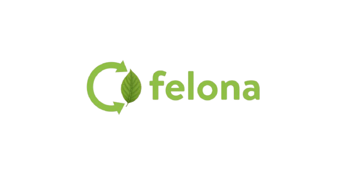

# FeloNa - Smart Waste Management & Circular Economy Platform ♻️

<div align="center">



**"Felo na, value koro."** - Transform waste into value

[](https://flutter.dev)
[](https://dart.dev)
[](LICENSE)

</div>

---

## 📖 Overview

**FeloNa** is a comprehensive mobile application that transforms waste management through technology, sustainability, and community interaction. The platform connects three user roles (Normal Users, Buyers, Collectors) in a circular-economy ecosystem.

### Key Features

- 🛒 **Marketplace System** - Sell old items and reusable products
- ♻️ **Scrap Selling** - Trade recyclable materials (plastic, paper, metal, glass, e-waste)
- 🚛 **Smart Pickup System** - On-demand waste collection with real-time tracking
- 💬 **Real-Time Chat** - Direct communication between users, buyers, and collectors
- 🌱 **Eco Score & Gamification** - Track environmental impact and earn rewards
- 🔔 **Push Notifications** - Stay updated on offers, pickups, and messages

---

## 🎯 User Roles

### 👤 Normal User
- Sell old items and recyclable waste
- Request waste pickups
- Chat with buyers
- Track eco score and recycling history

### 🛒 Buyer / Recycler
- Browse marketplace listings
- Purchase items or scrap
- Send offers and negotiate prices
- Manage purchases

### 🚛 Collector
- Receive nearby pickup requests
- Accept collection jobs
- Update pickup status
- Track earnings and completed jobs

---

## 🏗️ Architecture

### Clean Architecture + Feature-First Structure

```
lib/
├── core/                      # Core functionality
│   ├── constants/            # Colors, themes, enums
│   ├── errors/               # Error handling
│   ├── network/              # API client, storage
│   ├── utils/                # Utilities
│   └── widgets/              # Reusable UI components
│       ├── buttons/
│       ├── cards/
│       ├── chips/
│       ├── dialogs/
│       ├── inputs/
│       ├── loading/
│       └── navigation/
├── features/                  # Feature modules
│   ├── auth/                 # Authentication
│   │   ├── data/
│   │   ├── domain/
│   │   └── presentation/
│   ├── marketplace/          # Marketplace & listings
│   ├── pickup/               # Pickup requests
│   ├── chat/                 # Real-time messaging
│   ├── eco_score/            # Eco tracking
│   └── notifications/        # Push notifications
└── main.dart                 # App entry point
```

### State Management
- **BLoC Pattern** (Business Logic Component)
- Separation of business logic from UI
- Reactive state management
- Testable architecture

---

## 🚀 Getting Started

### Prerequisites

- Flutter SDK (3.10.8 or higher)
- Dart SDK (3.0 or higher)
- Android Studio / VS Code
- Git

### Installation

1. **Clone the repository**
   ```bash
   git clone https://github.com/yourusername/felona.git
   cd felona/felo_na
   ```

2. **Install dependencies**
   ```bash
   flutter pub get
   ```

3. **Run the app**
   ```bash
   flutter run
   ```

### Build for Production

```bash
# Android
flutter build apk --release

# iOS
flutter build ios --release
```

---

## 📦 Dependencies

### Core Dependencies
- `flutter_bloc` - State management
- `equatable` - Value equality
- `dartz` - Functional programming
- `dio` - HTTP client
- `flutter_secure_storage` - Secure storage
- `get_it` - Dependency injection

### Firebase
- `firebase_core` - Firebase core
- `firebase_messaging` - Push notifications

### UI & Media
- `image_picker` - Image selection
- `cached_network_image` - Image caching
- `intl` - Internationalization

### Development
- `mockito` - Mocking for tests
- `bloc_test` - BLoC testing
- `build_runner` - Code generation

---

## 🎨 Design System

### Color Palette

#### Primary Colors (Eco Green)
- `primary-500`: `#2ECC71` - Main brand color
- `primary-700`: `#1B7A43` - Dark variant
- `primary-300`: `#7FE5A8` - Light variant

#### Secondary Colors (Earth Brown)
- `secondary-500`: `#8D6E63` - Collector accent

#### Accent Colors (Sky Blue)
- `accent-500`: `#03A9F4` - Buyer accent

#### Semantic Colors
- Success: `#27AE60`
- Warning: `#F39C12`
- Error: `#E74C3C`
- Info: `#3498DB`

### Typography
- **Font Family**: Inter (Google Fonts)
- **Type Scale**: Display, Headline, Body, Label

### Spacing
- **Base Unit**: 4px
- **Scale**: xs (4px), sm (8px), md (16px), lg (24px), xl (32px)

---

## 🧪 Testing

### Run Tests

```bash
# Unit tests
flutter test

# Widget tests
flutter test test/widgets

# Integration tests
flutter test integration_test
```

### Test Coverage

```bash
flutter test --coverage
genhtml coverage/lcov.info -o coverage/html
```

---

## 📱 Features Implementation Status

| Feature | Status | Progress |
|---------|--------|----------|
| Core Foundation | ✅ Complete | 100% |
| Authentication | 🚧 In Progress | 60% |
| Marketplace | ⏳ Planned | 0% |
| Pickup System | ⏳ Planned | 0% |
| Chat | ⏳ Planned | 0% |
| Eco Score | ⏳ Planned | 0% |
| Notifications | ⏳ Planned | 0% |

See [IMPLEMENTATION_PROGRESS.md](IMPLEMENTATION_PROGRESS.md) for detailed progress.

---

## 🤝 Contributing

Contributions are welcome! Please follow these steps:

1. Fork the repository
2. Create a feature branch (`git checkout -b feature/AmazingFeature`)
3. Commit your changes (`git commit -m 'Add some AmazingFeature'`)
4. Push to the branch (`git push origin feature/AmazingFeature`)
5. Open a Pull Request

### Code Style
- Follow [Effective Dart](https://dart.dev/guides/language/effective-dart) guidelines
- Use meaningful variable and function names
- Add comments for complex logic
- Write tests for new features

---

## 📄 License

This project is licensed under the MIT License - see the [LICENSE](LICENSE) file for details.

---

## 👥 Team

- **Project Lead** - [Your Name]
- **UI/UX Designer** - [Designer Name]
- **Backend Developer** - [Backend Dev Name]

---

## 📞 Contact

- **Email**: support@felona.com
- **Website**: https://felona.com
- **Twitter**: [@FeloNaApp](https://twitter.com/felonaapp)

---

## 🙏 Acknowledgments

- Flutter team for the amazing framework
- Material Design for design guidelines
- Open source community for packages and tools

---

<div align="center">

**Made with ❤️ for a sustainable future**

[Report Bug](https://github.com/yourusername/felona/issues) · [Request Feature](https://github.com/yourusername/felona/issues)

</div>
